# 🎬 CineScope

CineScope is a modern Android application for discovering movies, TV shows, and actors. Users can explore content, add favorites, and easily access content with detailed search and filtering options.

---

## 🌟 Purpose of the App

CineScope allows users to view movies, TV shows, and actors.  
Users can:

- Explore movies and TV shows
- Mark their favorite content
- Check actor profiles
- Sort content by categories, popularity, trending, or top rated

---
## 📸 Screenshots
<div style="display: flex; gap: 60px; align-items: flex-start;">
  <!-- Movie Column -->
  <div>
    <h2>🎬 Movie</h2>
    <div style="display: flex; gap: 20px; flex-wrap: wrap;">
      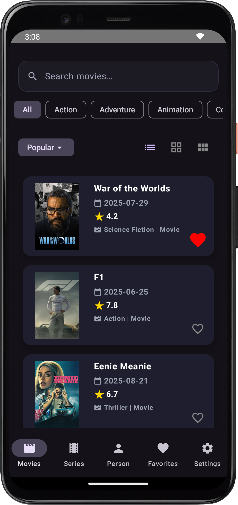
      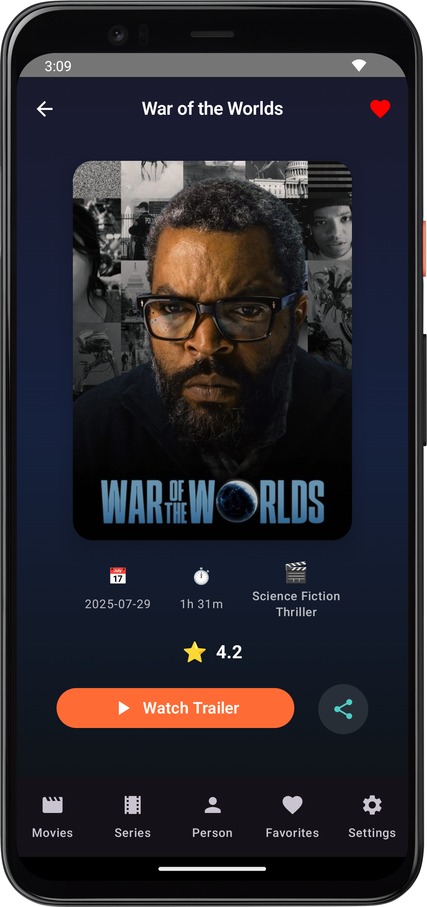
      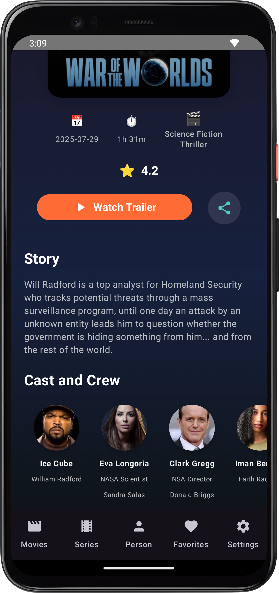
    </div>
  </div>

   <div>
    <h2>📺 Serie Screens</h2>
    <div style="display: flex; gap: 30px; flex-wrap: wrap;">
      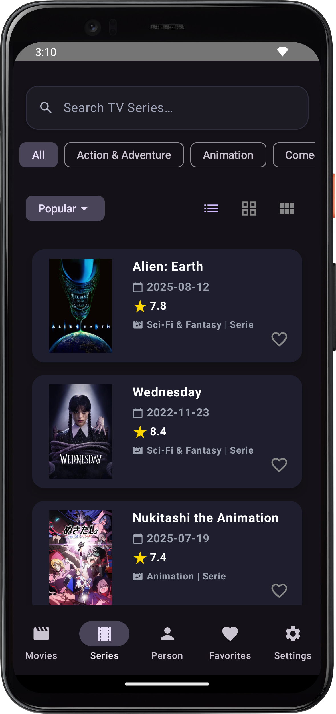
      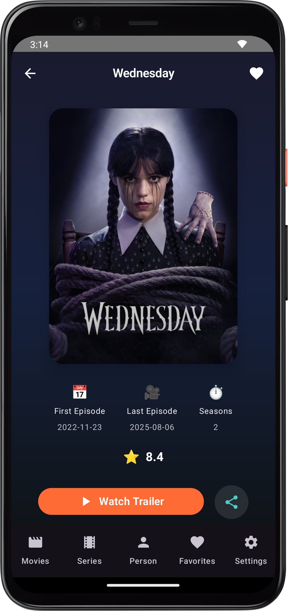
      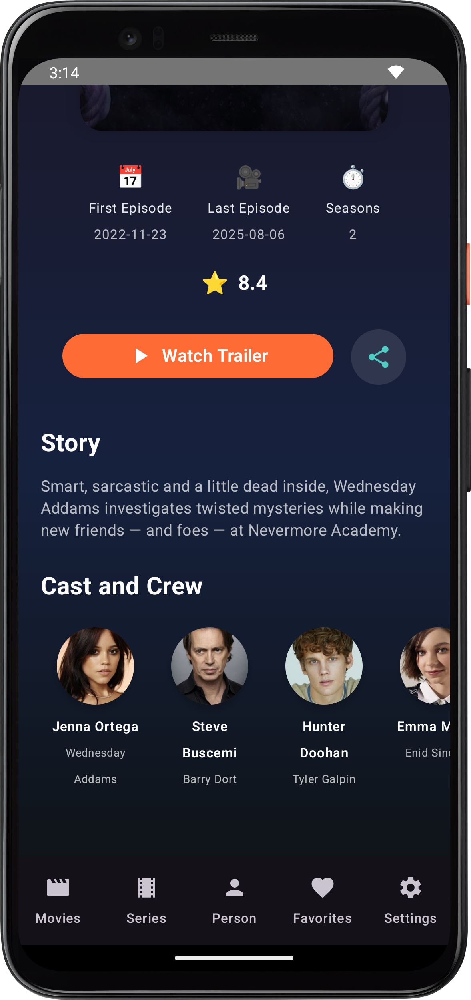
    </div>
  </div>

   <div>
    <h2>👤 Person Screens</h2>
    <div style="display: flex; gap: 30px; flex-wrap: wrap;">
      
      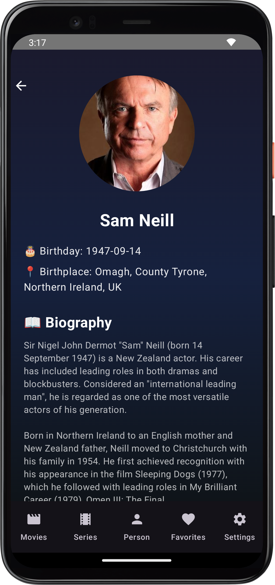
      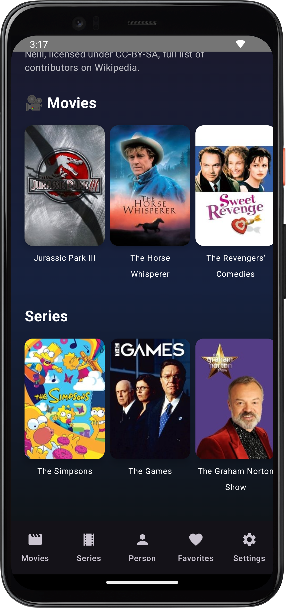
    </div>
  </div>

  <div>
    <h2>⭐ Favorite Screens</h2>
    <div style="display: flex; gap: 40px; justify-content: center; flex-wrap: wrap;">
  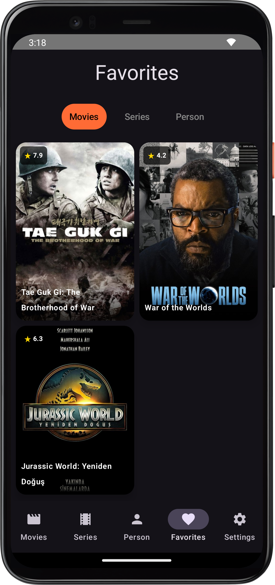
  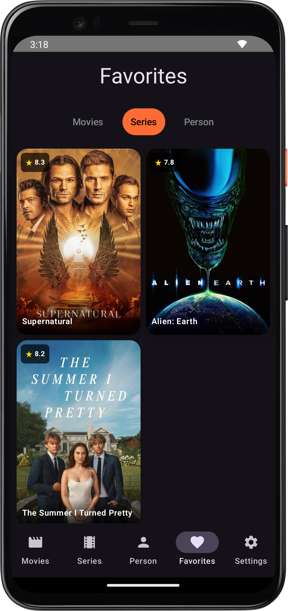
  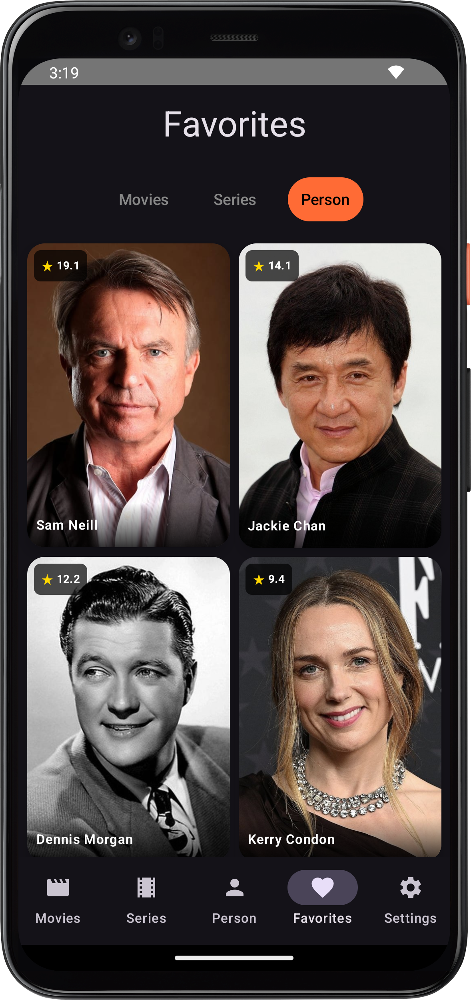
    </div>
  </div>
  
  <div>
    <h2>⚙️ Settings Screens</h2>
    <div style="display: flex; gap: 40px; justify-content: center; flex-wrap: wrap;">
  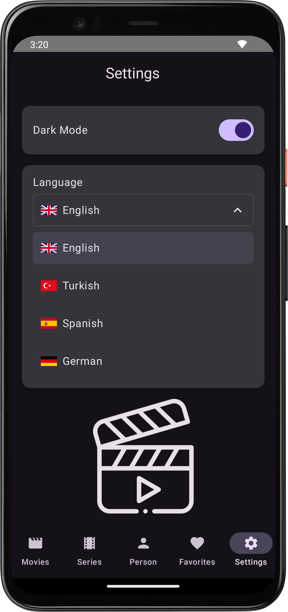
  
  </div>
  </div>


---

## 🛠️ Features

### 🔎 General Features
- Movie & TV show lists: filter by popular, trending, and top rated content
- Detailed search: advanced search bar on the movie screen
- Sort by category: filter content by genre or category
- Grid view: display content in 2-column or 3-column grids
- Add to favorites: movies, TV shows, and actors
- **Theme Support**: Dark Mode and Light Mode
- **Multilingual Support**: Interface available in English, Turkish, Spanish, and German

### 🎥 Movie Detail Screen
- View detailed information about movies (title, genre, release date, rating, etc.)
- Watch trailers
- Share movies with others
- View cast and crew

### 📺 TV Show Detail Screen
- View detailed information about TV shows (title, seasons, genre, rating, etc.)
- Watch trailers
- Share TV shows with others
- View cast and crew

### 👤 Person Detail Screen
- View detailed biography of actors/actresses
- See movies and TV shows they starred in
- Add to favorites and follow


---

## ⚙️ Technologies

CineScope is developed using modern Android development techniques and popular libraries:

- **Language**: Kotlin
- **UI**: Jetpack Compose
- **Dependency Injection**: Hilt & Koin
- **Networking & API**: Retrofit
- **Image Loading**: Coil
- **Data Management & Pagination**: Room + Paging 3
- **Architecture**: MVVM (Model-View-ViewModel)
- **Project Structure**: Clean Architecture (Domain, Data, Presentation layers)

---

## 🚀 Getting Started

### Requirements

- Android Studio
- Kotlin 1.5+
- Android 5.0 (API 21)+
### 🔑 TMDB API Key

This project uses the [TMDB API](https://www.themoviedb.org/documentation/api) for fetching movie data.  
To run the project, you need to add your TMDB API key in a `local.properties` file:

```properties
TMDB_API_KEY=your_api_key_here
```
### Installation

```bash
git clone https://github.com/CenkerAydin/CineScope.git

